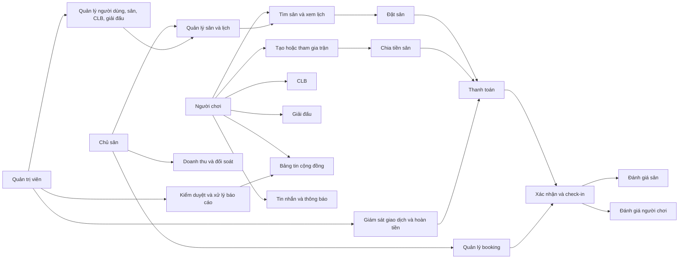

# TỔNG QUAN NGHIỆP VỤ DỰ ÁN PICKLINK

> Phiên bản tài liệu: 1.0  
> Ngày khảo sát mã nguồn: 20/06/2026  
> Phạm vi khảo sát: ứng dụng web trong thư mục `Picklink_Web`

## 1. Giới thiệu chung

PickLink là nền tảng kết nối hệ sinh thái thể thao vợt, trọng tâm hiện tại là Pickleball. Hệ thống phục vụ ba nhóm người dùng chính:

- Người chơi tìm sân, đặt lịch, thanh toán, check-in và đánh giá trải nghiệm.
- Chủ sân quản lý cụm sân, sân con, lịch khai thác, booking, doanh thu và đối soát.
- Quản trị viên vận hành nền tảng, kiểm duyệt nội dung và xử lý các vấn đề phát sinh.

Ngoài quy trình đặt sân, PickLink còn hỗ trợ tìm đối thủ, chia tiền sân theo trận, quản lý câu lạc bộ, bảng tin cộng đồng, giải đấu, tin nhắn và thông báo.

### Mục tiêu nghiệp vụ

1. Giúp người chơi tìm được sân và người chơi phù hợp theo địa điểm, thời gian và trình độ.
2. Số hóa quy trình đặt sân từ chọn lịch đến thanh toán, xác nhận và check-in.
3. Cung cấp công cụ vận hành tập trung cho chủ sân.
4. Xây dựng cộng đồng Pickleball thông qua CLB, bài viết, trận đấu và giải đấu.
5. Đảm bảo chất lượng nền tảng bằng quy trình duyệt, báo cáo, hoàn tiền, đối soát và nhật ký quản trị.

## 2. Bản đồ nghiệp vụ tổng thể

## 3. Tác nhân và quyền nghiệp vụ

| Tác nhân | Trách nhiệm và quyền chính |
|---|---|
| Khách chưa đăng nhập | Xem trang chủ, danh sách và chi tiết sân, CLB, bài viết, giải đấu. Đăng ký, đăng nhập và khôi phục mật khẩu. |
| Người chơi (`player`) | Đặt sân, thanh toán, quản lý booking, check-in, tìm đối thủ, tạo/tham gia trận, quản lý trận, đăng bài, tham gia CLB/giải đấu, đánh giá, nhắn tin, nhận thông báo và cập nhật hồ sơ. |
| Chủ sân (`owner`) | Quản lý cụm sân và sân con, trạng thái khai thác, lịch sân, booking, thanh toán/check-in, doanh thu, tài khoản nhận tiền và quy tắc vận hành. |
| Quản trị viên (`admin`) | Quản lý người dùng, sân, CLB, booking, báo cáo, bài viết, đánh giá, giải đấu, giao dịch và cấu hình toàn hệ thống. |
| Ban quản trị CLB | Duyệt thành viên, phân vai trò/quyền, khóa thành viên, tạo sự kiện, duyệt/ghim/xóa bài và quản lý chat CLB. Đây là quyền trong phạm vi CLB, không phải role đăng nhập toàn hệ thống. |

### Phân quyền truy cập hiện có

- Khu vực `/admin/*` chỉ dành cho `admin`.
- Khu vực `/owner/*` chỉ dành cho `owner`.
- Các chức năng cá nhân, cộng đồng có thao tác ghi và thanh toán chỉ dành cho `player`.
- Người chưa đăng nhập truy cập trang được bảo vệ sẽ được chuyển đến đăng nhập.
- Người đã đăng nhập nhưng sai vai trò sẽ được chuyển đến trang không có quyền.

## 4. Các đối tượng nghiệp vụ cốt lõi

| Đối tượng | Ý nghĩa | Thông tin chính |
|---|---|---|
| Người dùng | Tài khoản sử dụng nền tảng | Họ tên, email, điện thoại, avatar, vai trò, trình độ, khu vực, hình thức chơi ưu tiên |
| Cụm sân | Một địa điểm kinh doanh sân | Tên, địa chỉ, khu vực, quản lý, giờ mở cửa, giá cơ bản, tiện ích, hình ảnh, mô tả, trạng thái |
| Sân con | Đơn vị sân có thể đặt lịch | Mã/tên sân, loại sân, mặt sân, trong nhà/ngoài trời, giá, trạng thái |
| Khung giờ | Khoảng thời gian khai thác của sân con | Ngày, giờ bắt đầu/kết thúc, trạng thái trống/đã đặt/khóa/sự kiện |
| Booking | Đơn giữ và sử dụng sân | Mã đơn, khách, sân, ngày giờ, thời lượng, đơn giá, phí dịch vụ, tổng tiền, thanh toán, check-in |
| Giao dịch | Dòng tiền liên quan booking hoặc giải đấu | Mã giao dịch, phương thức, số tiền, trạng thái, phí nền tảng, hoàn tiền, đối soát |
| Trận ghép | Lời mời tìm người chơi | Chủ trận, trình độ, khu vực, sân, giờ chơi, 1vs1/2vs2, số người, chi phí |
| CLB | Cộng đồng người chơi | Thông tin CLB, thành viên, vai trò, quyền, sự kiện, bài viết, chat |
| Bài viết | Nội dung cộng đồng | Tác giả, chủ đề, phạm vi hiển thị, nội dung, ảnh, thẻ, sân, lượt tương tác |
| Giải đấu | Hoạt động thi đấu có đăng ký | Địa điểm, thời gian, thể thức, hạng mục, sức chứa, lệ phí, giải thưởng, lịch trình |
| Đánh giá | Phản hồi sau trải nghiệm | Đối tượng là sân hoặc người chơi, điểm thành phần, thẻ nhận xét, nội dung, ẩn danh |
| Báo cáo vi phạm | Yêu cầu admin can thiệp | Đối tượng bị báo cáo, mức ưu tiên, trạng thái xử lý, phản hồi và kết quả |
| Thông báo/Tin nhắn | Kênh giao tiếp theo sự kiện nghiệp vụ | Loại sự kiện, người nhận, trạng thái đọc, liên kết đến đối tượng liên quan |

## 5. Các phân hệ nghiệp vụ

### 5.1. Tài khoản và hồ sơ người chơi

- Đăng ký bằng họ tên, email, số điện thoại, mật khẩu và chấp nhận điều khoản.
- Đăng nhập và điều hướng theo vai trò.
- Khôi phục mật khẩu theo luồng: yêu cầu mã → xác thực OTP 6 số → đặt mật khẩu mới → thành công.
- Quản lý hồ sơ gồm avatar, thông tin liên hệ, trình độ, tỉnh/phường, hình thức 1vs1/2vs2 và danh sách sân yêu thích.
- Đổi mật khẩu và đăng xuất.

### 5.2. Tìm sân và đặt sân

- Tìm sân theo tên, thành phố, khoảng cách, mức giá và bộ lọc nâng cao.
- Xem thông tin sân: vị trí, giá, đánh giá, tiện ích, khung giờ và số sân còn trống.
- Chọn ngày, sân con và một dải thời gian liên tiếp trên lịch.
- Các ô đã đặt, bị khóa hoặc dành cho sự kiện không thể chọn.
- Hệ thống tính thời lượng và tiền sân trước khi chuyển sang thanh toán.
- Người chơi theo dõi lịch sử booking, tìm theo mã đơn/sân/khu vực và lọc theo trạng thái.

### 5.3. Thanh toán, giữ chỗ và check-in

- Phương thức thể hiện trên giao diện: ví điện tử (MoMo, ZaloPay, VNPay), chuyển khoản QR và thanh toán tại sân.
- Tổng tiền gồm tiền thuê sân theo thời lượng và phí dịch vụ hệ thống.
- Booking có thể được giữ tạm trong khi chờ thanh toán; hết hạn giữ chỗ thì slot cần được mở lại.
- Khi thanh toán thành công và sân được xác nhận, người chơi nhận mã booking để check-in.
- Người chơi có thể thanh toán lại, hủy booking hoặc check-in khi trạng thái cho phép.
- Chủ sân có thể xác nhận/hủy đơn, ghi nhận đã thanh toán, check-in hoặc đánh dấu khách vắng mặt.

### 5.4. Tìm đối thủ và ghép trận

- Người chơi tạo lời mời theo trình độ, tỉnh/phường, sân, sân con, ngày, giờ, hình thức 1vs1/2vs2 và ghi chú.
- Có thể lọc danh sách lời mời theo chủ lời mời, hình thức, trình độ, khu vực, sân và ngày.
- Người chơi tham gia lời mời còn chỗ; số người tham gia không vượt quá số người cần.
- Chi phí sân được chia đều cho tổng số người của trận và làm tròn lên từng người.
- Người tạo hoặc người tham gia theo dõi các trạng thái: đang ghép, chờ thanh toán, đã xác nhận và đã hủy.
- Trận bị hủy có thể được mở lại; trận đủ người chuyển sang bước thanh toán và xác nhận lịch.

### 5.5. Câu lạc bộ

- Tìm và xem CLB theo thông tin chung, lịch hoạt động, thành viên và bài viết.
- Người chơi tạo CLB bằng tên, khu vực, địa chỉ và mô tả.
- Thành viên gửi yêu cầu tham gia; quản trị CLB chấp nhận hoặc từ chối.
- Hệ thống quyền nội bộ CLB:
  - Chủ nhiệm: toàn quyền.
  - Quản trị viên: duyệt thành viên, tạo sự kiện, quản lý bài viết và chat.
  - Huấn luyện viên: tạo sự kiện và chat.
  - Thành viên: chat CLB.
- Quản trị CLB có thể đổi vai trò, tạm khóa thành viên, tạo sự kiện, duyệt/ghim/xóa bài và gửi tin nhắn.
- Sự kiện CLB có trạng thái đang mở, sắp diễn ra hoặc đã khóa; bài viết có trạng thái nháp, chờ duyệt hoặc đã đăng.

### 5.6. Cộng đồng và nội dung

- Bảng tin hỗ trợ thích, lưu, chia sẻ, bình luận và trả lời bình luận.
- Người chơi tạo bài theo nhóm: thảo luận, tìm người chơi, review sân/dụng cụ hoặc kỹ thuật tập luyện.
- Phạm vi hiển thị gồm công khai, trong CLB hoặc bạn bè.
- Bài tìm người có thể khai báo số chỗ, khoảng trình độ và giờ chơi.
- Admin kiểm duyệt bài chờ duyệt, bài bị báo cáo, nội dung ẩn và nhãn nội dung.

### 5.7. Giải đấu

- Xem danh sách và chi tiết giải: địa điểm, điều lệ, lịch trình, hạng mục, sức chứa, lệ phí, giải thưởng và danh sách đội.
- Chỉ giải đang mở mới nhận đăng ký.
- Người chơi đăng ký tên đội, người đại diện và hạng mục thi đấu.
- Theo dõi đăng ký cá nhân, trạng thái duyệt, thanh toán, mã check-in và hạt giống nếu có.
- Admin duyệt giải, cấu hình bảng đấu, nhập kết quả, công bố kết quả và đối soát lệ phí.

### 5.8. Đánh giá và uy tín

- Đánh giá sân sau booking đã check-in hoặc hoàn tất.
- Đánh giá người chơi sau khi trận hoàn tất.
- Đánh giá sân theo chất lượng, vệ sinh, phục vụ và độ chính xác thông tin.
- Đánh giá người chơi theo đúng giờ, thái độ, trình độ và fair-play.
- Hỗ trợ thẻ nhận xét, nội dung tự do và chế độ ẩn danh.
- Admin xử lý đánh giá chờ duyệt, bị báo cáo hoặc nghi ngờ spam.

### 5.9. Tin nhắn và thông báo

- Hội thoại được phân loại theo trận, booking, CLB hoặc trao đổi trực tiếp.
- Có tìm kiếm, lọc hội thoại chưa đọc và gửi tin nhắn.
- Thông báo được phân loại theo ghép trận, thanh toán, sân, CLB, giải đấu và hệ thống.
- Người dùng có thể đánh dấu đã đọc, xóa, xóa các thông báo đã đọc và bật/tắt nhóm thông báo.

### 5.10. Vận hành dành cho chủ sân

- Quản lý cụm sân và sân con, tìm kiếm/lọc theo trạng thái.
- Tạo/sửa thông tin sân: loại sân, địa chỉ, giờ mở cửa, quản lý, giá, ảnh, tiện ích, mặt sân và số sân con.
- Chuyển trạng thái sân giữa hoạt động, bảo trì và đóng cửa.
- Xem lịch theo lưới 30 phút; xác nhận booking chờ, hủy booking hoặc khóa nhanh khung giờ để bảo trì/sự kiện.
- Theo dõi doanh thu theo ngày/tuần/tháng, doanh thu từng sân, phương thức thanh toán, tỷ lệ thành công và giá trị đơn trung bình.
- Cấu hình quy tắc đặt sân, thông báo vận hành, tài khoản ngân hàng và chu kỳ đối soát.

### 5.11. Quản trị hệ thống

Admin có các khu vực nghiệp vụ sau:

1. Tổng quan vận hành và hàng chờ cần xử lý.
2. Người dùng: khóa/mở khóa, duyệt hồ sơ chủ sân, phân quyền và xem lịch sử.
3. Sân: duyệt, từ chối, yêu cầu bổ sung, kiểm tra hoặc khóa sân.
4. CLB: duyệt, cảnh báo, khóa và kiểm tra nội dung/thành viên.
5. Booking: theo dõi thanh toán, check-in, hủy lịch và tranh chấp.
6. Báo cáo: phân loại báo cáo về người chơi, bài viết, sân hoặc CLB.
7. Bài viết và đánh giá: duyệt, ẩn, gắn nhãn, xử lý spam và khóa tài khoản vi phạm.
8. Giải đấu: duyệt giải, quản lý bảng đấu, lịch, kết quả và đối soát.
9. Giao dịch: theo dõi thành công, thất bại, hoàn tiền và chờ đối soát.
10. Cấu hình: giữ chỗ, phí nền tảng, hoàn tiền, kiểm duyệt, bảo mật và nhật ký.

## 6. Các luồng nghiệp vụ trọng yếu

### 6.1. Luồng đặt sân

1. Người chơi tìm và chọn cụm sân.
2. Người chơi chọn ngày, sân con và các ô thời gian liên tiếp còn trống.
3. Hệ thống tính thời lượng và tiền sân.
4. Hệ thống tạo booking ở trạng thái giữ tạm và khóa slot trong thời gian chờ.
5. Người chơi chọn phương thức, chấp nhận điều khoản và thanh toán.
6. Giao dịch thành công hoặc lựa chọn trả tại sân đưa đơn tới bước chủ sân xác nhận.
7. Chủ sân xác nhận booking; hệ thống phát hành/cho phép dùng mã check-in.
8. Người chơi check-in, sử dụng sân và có thể đánh giá sau trải nghiệm.
9. Nếu thanh toán lỗi, hết hạn giữ chỗ hoặc bị hủy, slot được giải phóng theo chính sách.

### 6.2. Luồng ghép trận

1. Chủ trận chọn sân, thời gian, hình thức và trình độ mong muốn.
2. Hệ thống đăng lời mời ở trạng thái đang chờ.
3. Người chơi phù hợp tìm và tham gia lời mời.
4. Khi đủ người, hệ thống tính phần chi phí của từng người.
5. Các thành viên thanh toán phần của mình.
6. Trận được xác nhận khi đáp ứng điều kiện người chơi và thanh toán.
7. Sau trận, các thành viên có thể đánh giá lẫn nhau.

### 6.3. Luồng tham gia CLB

1. Người chơi xem thông tin và gửi yêu cầu tham gia.
2. Quản trị CLB duyệt hoặc từ chối yêu cầu.
3. Khi được duyệt, người chơi được thêm với vai trò Thành viên.
4. Chủ nhiệm/quản trị viên có thể thay đổi vai trò và quyền trong CLB.
5. Thành viên tham gia sự kiện, bài viết và chat theo quyền được cấp.

### 6.4. Luồng đăng ký giải đấu

1. Người chơi chọn giải đang mở và kiểm tra điều lệ, hạng mục, lệ phí, số slot.
2. Người chơi khai báo đội/người đại diện và hạng mục.
3. Đăng ký được tạo ở trạng thái chờ duyệt, danh sách chờ hoặc xác nhận.
4. Người chơi thanh toán lệ phí và nhận mã check-in khi đủ điều kiện.
5. Ban tổ chức/admin cấu hình bảng đấu, nhập kết quả và công bố kết quả.

### 6.5. Luồng báo cáo và xử lý vi phạm

1. Báo cáo được tạo từ người dùng, sân, CLB, bài viết hoặc đánh giá.
2. Hệ thống phân loại đối tượng và mức ưu tiên.
3. Admin mở hồ sơ, kiểm tra bằng chứng và lịch sử tái phạm.
4. Admin có thể bỏ qua, nhắc nhở, ẩn nội dung, khóa tạm, khóa tài khoản/CLB/sân hoặc hoàn tiền.
5. Kết quả và thao tác nhạy cảm cần được lưu vào nhật ký quản trị.

## 7. Mô hình trạng thái

### 7.1. Booking

Booking dùng ba nhóm trạng thái độc lập:

| Nhóm | Giá trị | Ý nghĩa |
|---|---|---|
| Trạng thái đơn | `holding` | Đang giữ tạm/chờ chủ sân xử lý |
|  | `confirmed` | Sân đã được xác nhận và giữ cho khách |
|  | `cancelled` | Đơn đã hủy, không còn giữ sân |
| Thanh toán | `pending` | Chưa hoàn tất hoặc sẽ trả tại sân |
|  | `paid` | Đã ghi nhận thanh toán |
|  | `failed` | Thanh toán lỗi |
| Check-in | `not_open` | Chưa đến thời điểm check-in |
|  | `ready` | Có thể check-in |
|  | `checked_in` | Khách đã nhận sân |
|  | `missed` | Khách vắng mặt/quá giờ |
|  | `cancelled` | Check-in không còn áp dụng |

Luồng điển hình:

`holding/pending/not_open` → `confirmed/paid/ready` → `confirmed/paid/checked_in`

Luồng ngoại lệ có thể kết thúc ở `cancelled`, `failed` hoặc `missed`.

### 7.2. Lịch sân

| Trạng thái | Ý nghĩa |
|---|---|
| Trống | Có thể chọn để đặt hoặc chủ sân khóa nhanh |
| `pending` | Booking chờ chủ sân xác nhận, dùng trong lịch vận hành chủ sân |
| `booked` | Đã có booking |
| `locked` | Bị khóa vì bảo trì hoặc lý do vận hành |
| `event` | Dành cho sự kiện |

### 7.3. Trận ghép

`waiting` → `payment` → `confirmed`

- Có thể chuyển sang `cancelled` từ quá trình đang xử lý.
- Trận đã hủy có thể mở lại về `waiting`.

### 7.4. Giải đấu và đăng ký

- Giải đấu: `open`, `upcoming`, `closed`, `finished`.
- Đăng ký: `pending`, `waitlist`, `confirmed`, `cancelled`.
- Đội tham dự: `pending`, `waitlist`, `approved`.

## 8. Quy tắc nghiệp vụ đang thể hiện trong giao diện

> Các giá trị dưới đây là cấu hình hoặc hành vi đang xuất hiện trong mã giao diện; một số chưa được backend thực thi.

- Lịch sân sử dụng bước thời gian 30 phút, dữ liệu mẫu khai thác từ 05:00 đến 22:30.
- Người chơi chỉ chọn một sân con tại một thời điểm và dải giờ phải liên tiếp.
- Không được chọn xuyên qua khung đã đặt, bị khóa hoặc dành cho sự kiện.
- Tiền sân = đơn giá theo giờ × thời lượng; tổng thanh toán = tiền sân + phí dịch vụ.
- Mức phí nền tảng mẫu dành cho admin là 5% trên booking thành công.
- Thời gian giữ chỗ được cấu hình mẫu là 15 phút; một số màn hình người chơi đang hiển thị 10 phút.
- Quy tắc mẫu của chủ sân: đặt trước tối thiểu 2 giờ, hủy trước 6 giờ, tự xác nhận khi đã thanh toán, cho phép trả tại sân và yêu cầu mã check-in.
- Chu kỳ đối soát chủ sân hỗ trợ hằng ngày, hằng tuần hoặc hằng tháng; dữ liệu mẫu chọn hằng tuần.
- Bài viết có từ 3 báo cáo trở lên được đưa vào hàng chờ kiểm duyệt theo cấu hình mẫu.
- SLA xử lý báo cáo ưu tiên cao được đặt mẫu là 30 phút.
- Đăng nhập admin yêu cầu OTP, thao tác nhạy cảm được lưu nhật ký 180 ngày theo cấu hình mẫu.
- Mật khẩu khôi phục phải có tối thiểu 6 ký tự và OTP gồm 6 số.

## 9. Ma trận chức năng rút gọn

| Chức năng | Khách | Người chơi | Chủ sân | Admin |
|---|:---:|:---:|:---:|:---:|
| Xem sân/CLB/bài viết/giải đấu | ✓ | ✓ | — | — |
| Đặt sân và thanh toán | — | ✓ | — | Giám sát |
| Check-in | — | ✓ | Xác nhận | Giám sát |
| Tạo/tham gia trận | — | ✓ | — | Xử lý báo cáo |
| Tạo và tham gia CLB | — | ✓ | — | Duyệt/khóa |
| Đăng bài và đánh giá | — | ✓ | — | Kiểm duyệt |
| Quản lý sân và lịch | — | — | ✓ | Duyệt/khóa |
| Quản lý booking chủ sân | — | — | ✓ | Hỗ trợ/tranh chấp |
| Doanh thu và đối soát | — | — | Xem dữ liệu của mình | Toàn hệ thống |
| Cấu hình hệ thống | — | — | Cấu hình phạm vi chủ sân | ✓ |

## 10. Hiện trạng triển khai trong mã nguồn

Phiên bản được khảo sát là prototype frontend React/Vite tương đối đầy đủ về màn hình nhưng chưa phải hệ thống nghiệp vụ hoàn chỉnh.

| Hạng mục | Hiện trạng quan sát được |
|---|---|
| Xác thực | Dùng ba tài khoản thử và lưu phiên người dùng trong `localStorage`; chưa có API xác thực thực tế. |
| Đăng ký/khôi phục mật khẩu | Có luồng giao diện và kiểm tra cơ bản; chưa gửi dữ liệu đến dịch vụ tài khoản/OTP. |
| Dữ liệu nghiệp vụ | Phần lớn là dữ liệu mock trong các file `src/data` hoặc khai báo trực tiếp trong component. |
| Thay đổi dữ liệu | Chủ yếu cập nhật React state; tải lại trang sẽ mất thay đổi. |
| Đặt sân | Chọn lịch và điều hướng được, nhưng checkout đang dùng booking mẫu thay vì dữ liệu lựa chọn thực tế. |
| Thanh toán | Chọn phương thức rồi chuyển thẳng đến trang thành công; chưa tích hợp cổng thanh toán/webhook. |
| Admin | Tìm kiếm, lọc, xem chi tiết và hộp xác nhận đã có; đa số thao tác xác nhận chưa thay đổi dữ liệu thật. |
| Chủ sân | Các thao tác lịch/booking/sân hoạt động trên state mô phỏng; màn hình tạo/sửa sân ghi rõ đang chờ nối backend. |
| Tin nhắn/thông báo | Hoạt động trong bộ nhớ của trang, chưa có realtime hoặc dịch vụ gửi thông báo. |
| Phân quyền | Bảo vệ route ở frontend; backend vẫn cần kiểm tra quyền độc lập cho mọi API. |

## 11. Điểm cần thống nhất trước khi phát triển backend

1. Chuẩn hóa một nguồn cấu hình cho thời gian giữ chỗ: hiện có cả 10 và 15 phút.
2. Thống nhất mô hình trạng thái giữa booking, lịch sân, giao dịch và check-in; tránh để component tự định nghĩa khác nhau.
3. Xác định chính sách hủy, hoàn tiền, no-show, phí nền tảng và thời điểm đối soát cụ thể.
4. Xác định điều kiện tự xác nhận booking trả online và booking trả tại sân.
5. Xác định khi nào check-in mở, cách xác thực mã và ai được quyền sửa trạng thái.
6. Quy định cơ chế giữ slot chống đặt trùng và xử lý timeout/thanh toán webhook.
7. Làm rõ quy trình đăng ký và phê duyệt tài khoản chủ sân; form đăng ký hiện chỉ thể hiện người dùng chung.
8. Làm rõ quan hệ giữa CLB, chủ sân, sự kiện CLB và giải đấu.
9. Xác định điều kiện đủ để đánh giá sân/người chơi, giới hạn một đánh giá cho mỗi booking/trận và cơ chế khiếu nại.
10. Thiết kế sự kiện thông báo cho mọi thay đổi quan trọng của booking, trận, CLB, giải đấu và thanh toán.
11. Bổ sung audit log bắt buộc cho khóa/mở khóa, duyệt/từ chối, hoàn tiền, xóa/ẩn nội dung và phân quyền.
12. Xác định phạm vi dữ liệu mà từng chủ sân hoặc quản trị viên được xem và thao tác.

## 12. Phạm vi ngoài phiên bản hiện tại

Trong mã nguồn được khảo sát chưa thấy triển khai hoàn chỉnh cho các phần sau:

- API/backend, cơ sở dữ liệu và đồng bộ dữ liệu thật.
- Cổng thanh toán, webhook, hoàn tiền và đối soát tự động.
- OTP/email/SMS thật.
- Bản đồ, định vị và tính khoảng cách thật.
- Chat realtime, push notification và thông báo đa kênh.
- Máy xếp lịch/bảng đấu và nhập kết quả giải đấu hoàn chỉnh.
- Hệ thống phân quyền chi tiết ở backend và audit log có lưu trữ.
- Cơ chế xử lý tranh chấp, khiếu nại và bằng chứng hoàn chỉnh.

---

Tài liệu này mô tả nghiệp vụ suy ra từ các màn hình, route, kiểu dữ liệu và hành vi hiện có trong mã nguồn. Khi có backend hoặc tài liệu yêu cầu chính thức, cần cập nhật lại các quy tắc, trạng thái và quyền để phản ánh nguồn nghiệp vụ chuẩn.
