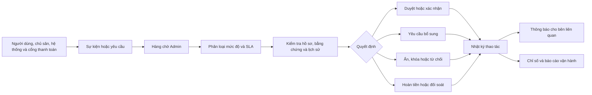

# TỔNG QUAN NGHIỆP VỤ ADMIN - PICKLINK

> Phiên bản tài liệu: 1.0  
> Ngày khảo sát mã nguồn: 20/06/2026  
> Phạm vi khảo sát: khu vực `/admin/*` của ứng dụng `Picklink_Web`  
> Tài liệu liên quan: [Tổng quan nghiệp vụ toàn hệ thống](./TONG_QUAN_NGHIEP_VU.md)

## 1. Mục đích tài liệu

Tài liệu mô tả phạm vi nghiệp vụ của quản trị viên PickLink, bao gồm:

- Mục tiêu vận hành và phạm vi trách nhiệm của Admin.
- Các phân hệ, hàng chờ, trạng thái và hành động quản trị.
- Luồng duyệt, kiểm duyệt, khóa/mở khóa, xử lý tranh chấp, hoàn tiền và đối soát.
- Quy tắc an toàn, phân quyền và yêu cầu nhật ký thao tác.
- Hiện trạng triển khai trong frontend và các phần cần bổ sung khi phát triển backend.

Tài liệu được suy ra từ route, cấu hình màn hình, dữ liệu mẫu và hành vi hiện có trong mã nguồn. Các con số trên dashboard là dữ liệu mô phỏng, không phải số liệu vận hành thật.

## 2. Vai trò của Admin trong hệ thống

Admin là nhóm người dùng chịu trách nhiệm đảm bảo nền tảng PickLink vận hành an toàn, minh bạch và đúng chính sách.

### Mục tiêu chính

1. Duy trì chất lượng người dùng, sân, CLB, bài viết, đánh giá và giải đấu.
2. Giám sát booking, thanh toán, check-in và các sự cố ảnh hưởng đến người chơi/chủ sân.
3. Xử lý báo cáo vi phạm, tranh chấp và khiếu nại trong SLA quy định.
4. Kiểm soát giao dịch, hoàn tiền, phí nền tảng và đối soát với chủ sân.
5. Bảo vệ hệ thống thông qua phân quyền, OTP, cảnh báo truy cập và audit log.
6. Theo dõi chỉ số vận hành để phát hiện hàng chờ quá hạn hoặc rủi ro bất thường.

### Phạm vi truy cập hiện tại

- Chỉ tài khoản có role `admin` được truy cập `/admin` và các route con.
- Tài khoản chưa đăng nhập được chuyển đến trang đăng nhập.
- Tài khoản đã đăng nhập nhưng không phải Admin được chuyển đến trang không có quyền.
- Mã nguồn hiện chỉ có một role Admin chung, chưa tách quyền theo nhóm vận hành, kiểm duyệt hoặc tài chính.

## 3. Mô hình vận hành Admin

### Nguyên tắc xử lý chung

1. Tiếp nhận đối tượng từ hàng chờ hoặc tìm kiếm trực tiếp.
2. Kiểm tra trạng thái, mức độ ưu tiên, SLA và người/nhóm phụ trách.
3. Mở chi tiết để đối chiếu dữ liệu và lịch sử liên quan.
4. Thu thập hoặc yêu cầu bổ sung bằng chứng nếu chưa đủ điều kiện quyết định.
5. Thực hiện hành động phù hợp với quyền được cấp.
6. Ghi lý do, dữ liệu trước/sau và người thực hiện vào audit log.
7. Gửi thông báo kết quả cho các bên liên quan.
8. Cập nhật hàng chờ, chỉ số và SLA.

## 4. Cấu trúc khu vực quản trị

| Phân hệ | Mục tiêu nghiệp vụ | Đối tượng chính |
|---|---|---|
| Tổng quan | Theo dõi sức khỏe vận hành và việc cần ưu tiên | Hàng chờ, SLA, nhóm phụ trách, cảnh báo |
| Người dùng | Quản lý tài khoản, xác minh và phân quyền | Người chơi, chủ sân, Admin |
| Sân | Duyệt và kiểm soát hoạt động của sân | Cụm sân, sân con, chủ sân |
| CLB | Duyệt CLB và xử lý rủi ro cộng đồng | CLB, chủ nhiệm, thành viên, sự kiện |
| Booking | Giám sát vòng đời đơn đặt sân | Booking, thanh toán, check-in, tranh chấp |
| Báo cáo | Điều phối xử lý vi phạm | Báo cáo người chơi, bài viết, sân, CLB |
| Bài viết | Kiểm duyệt nội dung cộng đồng | Bài viết, tác giả, nhãn, lượt báo cáo |
| Đánh giá | Kiểm soát review và spam | Đánh giá sân/người chơi, bằng chứng |
| Giải đấu | Duyệt và điều phối giải | Giải, đơn vị tổ chức, đăng ký, kết quả |
| Giao dịch | Kiểm soát dòng tiền | Giao dịch, hoàn tiền, phí, đối soát |
| Cấu hình | Thiết lập quy tắc vận hành chung | Booking, thanh toán, kiểm duyệt, bảo mật |

## 5. Nghiệp vụ chi tiết theo phân hệ

### 5.1. Tổng quan quản trị

Dashboard cung cấp cái nhìn tập trung về:

- Tổng số người dùng và tăng trưởng trong tháng.
- Số sân đang hoạt động và hồ sơ sân chờ duyệt.
- Booking trong ngày và tỷ lệ thanh toán thành công.
- Báo cáo đang mở và số vụ ưu tiên cao.
- Các luồng xử lý theo mức ưu tiên, nhóm phụ trách và SLA.

Các hàng chờ nổi bật gồm sân chờ duyệt, báo cáo quá hạn và hoàn tiền cần xác nhận. Admin có thể mở hàng chờ, phân công, kiểm duyệt, gắn cờ, xem log hoặc xuất báo cáo.

### 5.2. Quản lý người dùng

#### Phạm vi dữ liệu

- Họ tên, email, số điện thoại, vai trò, ngày tạo và trạng thái tài khoản.
- Trạng thái xác minh email, điện thoại hoặc hồ sơ chủ sân.
- Lịch sử khóa/mở khóa, báo cáo và thay đổi quyền.

#### Hàng chờ

- Hồ sơ chủ sân cần duyệt.
- Tài khoản bị báo cáo.
- Yêu cầu thay đổi số điện thoại hoặc thông tin định danh.

#### Hành động

- Xem hồ sơ và lịch sử.
- Duyệt hoặc yêu cầu bổ sung hồ sơ chủ sân.
- Khóa hoặc mở khóa tài khoản.
- Thêm Admin và phân quyền.
- Xem nhật ký của tài khoản quản trị.

#### Điều kiện kiểm tra đề xuất

- Đối chiếu email, số điện thoại và thông tin định danh.
- Kiểm tra vai trò hiện tại, lý do khóa trước đó và các báo cáo đang mở.
- Không cho Admin tự nâng quyền hoặc tự gỡ hạn chế của chính mình nếu không có phê duyệt phù hợp.

### 5.3. Duyệt và quản lý sân

#### Phạm vi dữ liệu

- Tên cụm sân, chủ sân, địa chỉ, số sân con và thời điểm cập nhật.
- Ảnh, tiện ích, giá, giờ hoạt động và hồ sơ pháp lý/liên hệ.
- Trạng thái: chờ duyệt, hoạt động, cần kiểm tra hoặc đã khóa.

#### Hàng chờ

- Hồ sơ sân mới chờ duyệt.
- Sân cần xác minh địa chỉ.
- Hồ sơ thiếu ảnh hoặc có dấu hiệu vi phạm ảnh/giá.
- Khiếu nại mở từ chủ sân.

#### Hành động

- Xem hồ sơ và đối chiếu thông tin chủ sân.
- Duyệt, từ chối hoặc yêu cầu bổ sung.
- Kiểm tra và nhắn chủ sân.
- Khóa/mở khóa sân và xem lý do xử lý.
- Duyệt hàng loạt khi các hồ sơ cùng đáp ứng điều kiện.

#### Kết quả nghiệp vụ

- Sân được duyệt có thể hiển thị và nhận booking.
- Sân bị khóa phải ngừng nhận booking mới; booking đang tồn tại cần quy tắc xử lý riêng.
- Từ chối hoặc yêu cầu bổ sung phải có lý do và thông báo cho chủ sân.

### 5.4. Quản lý CLB

#### Phạm vi dữ liệu

- Tên CLB, chủ nhiệm, khu vực, số thành viên và số báo cáo.
- Nội dung, sự kiện và lịch sử cảnh báo của CLB.
- Trạng thái: chờ duyệt, hoạt động, bị cảnh báo hoặc đã khóa.

#### Hành động

- Duyệt hoặc từ chối CLB mới.
- Gửi nhắc nhở/thông báo cho chủ nhiệm.
- Xử lý báo cáo và kiểm tra bài viết của CLB.
- Khóa CLB hoặc xem nhật ký xử lý.
- Xác minh sự kiện có dấu hiệu rủi ro.

#### Tác động khi khóa CLB

- CLB không được tiếp tục hoạt động công khai.
- Cần xác định trạng thái của thành viên, sự kiện, bài viết và chat hiện có.
- Hệ thống phải lưu lý do, thời hạn khóa và điều kiện mở lại.

### 5.5. Giám sát booking

Admin theo dõi booking toàn hệ thống nhưng không thay thế thao tác vận hành hằng ngày của chủ sân.

#### Phạm vi dữ liệu

- Mã booking, người đặt, sân/sân con, thời gian và số tiền.
- Trạng thái giữ chỗ, thanh toán, xác nhận, check-in, hủy và tranh chấp.
- Liên kết đến giao dịch, thông báo và lịch sử hỗ trợ.

#### Hàng chờ

- Booking chờ thanh toán.
- Yêu cầu hoàn tiền.
- Tranh chấp quá hạn.

#### Hành động

- Xem chi tiết và hỗ trợ các bên.
- Nhắc thanh toán hoặc hủy giữ chỗ.
- Mở vụ việc tranh chấp.
- Xem lý do hủy.
- Khởi tạo/duyệt quy trình hoàn tiền khi đủ điều kiện.

#### Nguyên tắc

- Booking online chưa thanh toán tự hết hạn theo thời gian giữ chỗ.
- Mọi can thiệp của Admin vào booking phải đồng bộ với lịch sân và giao dịch.
- Không được hoàn tiền chỉ bằng thay đổi trạng thái booking; phải có bản ghi tài chính tương ứng.

### 5.6. Xử lý báo cáo vi phạm

#### Loại đối tượng

- Người chơi.
- Bài viết.
- Sân.
- CLB.

#### Trạng thái thể hiện

- Chờ duyệt.
- Đang xử lý.
- Quá hạn.
- Đã phản hồi/đã có kết quả.

#### Luồng xử lý

1. Nhận báo cáo và tạo mã vụ việc.
2. Phân loại đối tượng, mức độ và mức ưu tiên.
3. Phân công Admin/nhóm phụ trách.
4. Kiểm tra nội dung, bằng chứng và lịch sử tái phạm.
5. Liên hệ bên liên quan khi cần làm rõ.
6. Quyết định bỏ qua, nhắc nhở, ẩn nội dung, khóa tạm, khóa đối tượng hoặc hoàn tiền.
7. Ghi kết quả và phản hồi người gửi.

#### Hàng chờ ưu tiên

- Báo cáo ưu tiên cao.
- Báo cáo chờ phản hồi người gửi.
- Trường hợp cần khóa tạm.
- Báo cáo quá SLA cần trưởng nhóm xem xét.

### 5.7. Kiểm duyệt bài viết

#### Trạng thái

- Chờ duyệt.
- Đang hiển thị.
- Bị báo cáo.
- Đã ẩn.

#### Hành động

- Xem, duyệt và sửa nhãn nội dung.
- Ghim hoặc đưa bài vào khu vực nổi bật.
- Ẩn bài, ẩn hàng loạt hoặc nhắc nhở tác giả.
- Bỏ qua báo cáo nếu nội dung không vi phạm.

#### Điểm cần kiểm tra

- Tiêu đề, nội dung, ảnh/video, hashtag và liên kết sân/CLB.
- Số lượng và nội dung báo cáo.
- Lịch sử vi phạm của tác giả.
- Mức độ phù hợp của nhãn/chủ đề.

### 5.8. Kiểm duyệt đánh giá

#### Phạm vi

- Đánh giá sân hoặc người chơi.
- Người đánh giá, điểm số, nội dung, trạng thái và số báo cáo.
- Liên kết đến booking hoặc trận làm căn cứ đánh giá.

#### Trạng thái

- Chờ duyệt.
- Đã hiển thị.
- Bị báo cáo.
- Spam.

#### Hành động

- Duyệt, xem hoặc đánh dấu nổi bật.
- Ẩn đánh giá và yêu cầu bằng chứng.
- Sửa lỗi chính tả trong phạm vi chính sách cho phép.
- Xóa spam hoặc khóa tài khoản tái phạm.

#### Quy tắc mẫu

- Đánh giá lặp nội dung hoặc đến từ tài khoản mới có thể bị ẩn tạm để kiểm tra.
- Review bị khiếu nại cần đối chiếu booking/trận và bằng chứng của các bên.

### 5.9. Quản lý giải đấu

#### Phạm vi

- Thông tin giải, đơn vị tổ chức, địa điểm và thời gian.
- Điều lệ, hạng mục, số đăng ký, lệ phí, lịch thi đấu và kết quả.
- Trạng thái: chờ duyệt, đang mở đăng ký, đang thi đấu hoặc đã kết thúc.

#### Hành động

- Tạo giải đấu hoặc duyệt hồ sơ do đơn vị tổ chức gửi.
- Yêu cầu bổ sung điều lệ/thông tin.
- Cấu hình bảng đấu và lịch thi đấu.
- Nhập kết quả, xử lý khiếu nại kết quả và công bố kết quả.
- Đối soát lệ phí sau khi giải kết thúc.

#### Điểm kiểm tra khi duyệt

- Tính đầy đủ và hợp lệ của điều lệ.
- Năng lực/định danh đơn vị tổ chức.
- Địa điểm, sức chứa, hạng mục, lệ phí và cơ cấu giải thưởng.
- Chính sách hủy, hoàn lệ phí và xử lý khiếu nại.

### 5.10. Giao dịch, hoàn tiền và đối soát

#### Nguồn giao dịch

- Thanh toán booking.
- Lệ phí giải đấu.
- Các khoản hoàn tiền hoặc điều chỉnh liên quan.

#### Trạng thái

- Thành công.
- Chờ đối soát.
- Hoàn tiền.
- Thất bại.

#### Hành động

- Xem biên nhận và lỗi từ cổng thanh toán.
- Xác nhận giao dịch và gắn ghi chú.
- Đối soát theo ngày hoặc theo chu kỳ của chủ sân.
- Duyệt/từ chối hoàn tiền.
- Gửi lại liên kết thanh toán khi giao dịch thất bại.

#### Điểm kiểm soát

- Đối chiếu mã giao dịch với booking/giải đấu và dữ liệu cổng thanh toán.
- Không tạo hai lần hoàn tiền cho cùng một khoản tiền.
- Ghi nhận tổng tiền, phí nền tảng, số tiền trả chủ sân và số tiền hoàn.
- Các sai lệch phí hoặc hoàn tiền quá hạn phải vào hàng chờ tài chính.

### 5.11. Cấu hình hệ thống

| Nhóm | Cấu hình hiện thể hiện | Giá trị mẫu |
|---|---|---|
| Đặt sân và thanh toán | Thời gian giữ booking chưa thanh toán | 15 phút |
| Đặt sân và thanh toán | Cho phép hoàn tiền tự động | Bật |
| Đặt sân và thanh toán | Phí nền tảng mặc định | 5% |
| Kiểm duyệt | Đưa bài có nhiều báo cáo vào hàng chờ | Từ 3 báo cáo |
| Kiểm duyệt | Ẩn tạm đánh giá nghi ngờ spam | Bật |
| Kiểm duyệt | SLA báo cáo ưu tiên cao | 30 phút |
| Bảo mật | Bắt buộc OTP cho Admin | Bật |
| Bảo mật | Thời gian lưu nhật ký nhạy cảm | 180 ngày |
| Bảo mật | Cảnh báo đăng nhập khác tỉnh | Bật |

Mọi thay đổi cấu hình phải lưu người thay đổi, giá trị trước/sau, thời điểm áp dụng và phạm vi ảnh hưởng.

## 6. Các luồng Admin trọng yếu

### 6.1. Duyệt tài khoản chủ sân

1. Hồ sơ mới vào hàng chờ xác minh.
2. Admin kiểm tra thông tin liên hệ, định danh và dữ liệu kinh doanh.
3. Nếu thiếu thông tin, chuyển sang yêu cầu bổ sung và thông báo cho người đăng ký.
4. Nếu hợp lệ, duyệt tài khoản/chuyển quyền chủ sân.
5. Nếu không hợp lệ, từ chối kèm lý do.
6. Hệ thống lưu nhật ký và cập nhật hàng chờ.

### 6.2. Duyệt sân mới

1. Chủ sân gửi hồ sơ cụm sân.
2. Admin kiểm tra chủ sở hữu, địa chỉ, ảnh, tiện ích, giá và số sân con.
3. Admin duyệt, yêu cầu bổ sung hoặc từ chối.
4. Sân được duyệt chuyển sang hoạt động và có thể nhận booking.
5. Tất cả quyết định được lưu log và gửi thông báo cho chủ sân.

### 6.3. Xử lý nội dung bị báo cáo

1. Hệ thống đưa nội dung vào hàng chờ theo số lượng/mức độ báo cáo.
2. Admin xem nội dung, báo cáo, người gửi, tác giả và lịch sử vi phạm.
3. Admin có thể bỏ qua, sửa nhãn, nhắc nhở, ẩn hoặc xóa mềm nội dung.
4. Trường hợp nghiêm trọng có thể khóa tạm hoặc khóa tài khoản.
5. Hệ thống phản hồi người báo cáo và lưu căn cứ xử lý.

### 6.4. Xử lý tranh chấp booking và hoàn tiền

1. Tranh chấp được mở từ booking có vấn đề.
2. Admin đối chiếu booking, lịch sân, thanh toán, check-in và trao đổi của các bên.
3. Admin yêu cầu thêm bằng chứng nếu dữ liệu chưa đủ.
4. Admin xác định trách nhiệm và áp dụng chính sách hủy/hoàn.
5. Nếu hoàn tiền, tạo yêu cầu tài chính và chuyển tới bước duyệt.
6. Cổng thanh toán xử lý hoàn; hệ thống cập nhật giao dịch, booking và đối soát.
7. Kết quả được thông báo cho người chơi và chủ sân.

### 6.5. Đối soát giao dịch

1. Hệ thống tập hợp giao dịch thành công theo kỳ.
2. Tính tổng tiền, phí nền tảng, khoản hoàn/điều chỉnh và số phải trả chủ sân.
3. Admin tài chính đối chiếu dữ liệu cổng thanh toán và booking.
4. Sai lệch được tách thành vụ việc để kiểm tra.
5. Kỳ đối soát hợp lệ được xác nhận và khóa dữ liệu.
6. Hệ thống phát hành báo cáo/biên nhận và ghi nhận thanh toán cho chủ sân.

### 6.6. Duyệt và đóng giải đấu

1. Hồ sơ giải vào hàng chờ duyệt điều lệ.
2. Admin xác minh đơn vị tổ chức, địa điểm, hạng mục, lệ phí và chính sách.
3. Giải được duyệt và mở đăng ký hoặc bị yêu cầu bổ sung/từ chối.
4. Trong thời gian thi đấu, Admin theo dõi lịch và nhập/xác nhận kết quả.
5. Khi kết thúc, xử lý khiếu nại, công bố kết quả và đối soát lệ phí.

## 7. Mô hình trạng thái quản trị

### 7.1. Trạng thái duyệt chung đề xuất

`Nháp` → `Chờ duyệt` → `Đang kiểm tra` → `Đã duyệt`

Nhánh ngoại lệ:

- `Chờ duyệt/Đang kiểm tra` → `Yêu cầu bổ sung` → `Chờ duyệt`.
- `Chờ duyệt/Đang kiểm tra` → `Từ chối`.
- `Đã duyệt/Hoạt động` → `Cảnh báo` → `Khóa tạm/Đã khóa` → `Mở khóa`.

### 7.2. Trạng thái báo cáo

`Mới` → `Đã phân công` → `Đang xử lý` → `Chờ phản hồi` → `Đã xử lý/Đã phản hồi`

Một báo cáo có thể chuyển sang `Quá hạn` khi vượt SLA mà chưa có kết quả.

### 7.3. Trạng thái giao dịch

`Khởi tạo` → `Đang xử lý` → `Thành công` → `Chờ đối soát` → `Đã đối soát`

Nhánh ngoại lệ:

- `Đang xử lý` → `Thất bại`.
- `Thành công` → `Yêu cầu hoàn` → `Đã duyệt hoàn/Từ chối hoàn` → `Đã hoàn`.

## 8. Hành động nhạy cảm và kiểm soát bắt buộc

Frontend hiện nhận diện các nhóm hành động nhạy cảm: khóa, mở khóa, từ chối, ẩn, xóa, hoàn tiền và duyệt hoàn.

| Hành động | Rủi ro | Kiểm soát cần có |
|---|---|---|
| Khóa tài khoản/sân/CLB | Ngừng quyền truy cập hoặc hoạt động | Lý do, thời hạn, phạm vi, thông báo và quyền mở khóa |
| Mở khóa | Khôi phục đối tượng rủi ro | Kiểm tra điều kiện khắc phục và lịch sử vi phạm |
| Từ chối hồ sơ | Chặn quyền kinh doanh/tham gia | Lý do chuẩn hóa, bằng chứng và cơ chế gửi lại hồ sơ |
| Ẩn nội dung | Ảnh hưởng hiển thị cộng đồng | Lý do, thời hạn ẩn và quyền khiếu nại |
| Xóa nội dung | Mất dữ liệu/bằng chứng | Ưu tiên xóa mềm, thời gian lưu và quyền khôi phục |
| Hoàn tiền | Tác động trực tiếp đến dòng tiền | Đối chiếu giao dịch, chống hoàn trùng, hạn mức và phê duyệt |
| Thay đổi quyền Admin | Rủi ro chiếm quyền | MFA, nguyên tắc bốn mắt và không tự nâng quyền |
| Thay đổi cấu hình | Ảnh hưởng toàn hệ thống | Xem trước tác động, audit giá trị trước/sau và rollback |

### Nguyên tắc xác nhận

- Hiển thị rõ hành động, đối tượng và tác động trước khi xác nhận.
- Bắt buộc nhập lý do đối với thao tác hạn chế hoặc tài chính.
- Các hành động vượt hạn mức phải có phê duyệt cấp hai.
- Backend phải kiểm tra lại quyền; không tin cậy kiểm soát route/nút ở frontend.
- Xử lý phải có tính idempotent để tránh gửi lặp hoặc hoàn tiền lặp.

## 9. Phân quyền Admin đề xuất

Mã nguồn hiện có một role `admin`. Để vận hành thực tế, nên tách quyền theo nhiệm vụ:

| Nhóm quyền | Phạm vi |
|---|---|
| Super Admin | Quản lý Admin, phân quyền, bảo mật và cấu hình toàn hệ thống |
| Operations Admin | Người dùng, chủ sân, sân, CLB và hàng chờ vận hành |
| Content Moderator | Báo cáo, bài viết, đánh giá và vi phạm cộng đồng |
| Support Admin | Booking, hỗ trợ người dùng và thu thập bằng chứng tranh chấp |
| Finance Admin | Giao dịch, hoàn tiền, phí nền tảng và đối soát |
| Tournament Admin | Hồ sơ giải, bảng đấu, lịch, kết quả và khiếu nại |
| Read-only/Auditor | Chỉ xem dữ liệu và audit log, không được thay đổi trạng thái |

Quyền nên được kiểm soát theo `resource + action`, ví dụ `booking.refund`, `court.approve`, `post.hide`, thay vì chỉ kiểm tra một role Admin chung.

## 10. Nhật ký và truy vết

Mỗi thao tác quản trị cần lưu tối thiểu:

- Mã sự kiện và thời gian.
- Admin thực hiện, vai trò, phiên đăng nhập và địa chỉ IP/thiết bị nếu phù hợp.
- Đối tượng, loại đối tượng và mã liên kết.
- Hành động và lý do.
- Dữ liệu/trạng thái trước và sau.
- Bằng chứng hoặc tệp đính kèm liên quan.
- Người phê duyệt thứ hai nếu có.
- Kết quả thực thi từ hệ thống ngoài như cổng thanh toán.
- Mã tương quan để nối booking, giao dịch, báo cáo và thông báo.

Nhật ký thao tác nhạy cảm có giá trị cấu hình mẫu là 180 ngày. Chính sách lưu thực tế cần được xác định theo yêu cầu pháp lý và vận hành.

## 11. Chỉ số và SLA quản trị

### Chỉ số vận hành chính

- Số hồ sơ người dùng/chủ sân/sân/CLB chờ duyệt.
- Thời gian duyệt trung bình và tỷ lệ hồ sơ bị yêu cầu bổ sung.
- Số báo cáo mở, quá hạn, ưu tiên cao và tái phạm.
- Thời gian phản hồi/xử lý báo cáo trung bình.
- Số bài/đánh giá bị ẩn hoặc phát hiện spam.
- Số booking chờ thanh toán, tranh chấp và tỷ lệ giải quyết thành công.
- Tỷ lệ giao dịch thành công/thất bại.
- Giá trị hoàn tiền, thời gian hoàn và số yêu cầu quá hạn.
- Giá trị chờ đối soát và sai lệch phí nền tảng.
- Số giải chờ duyệt, khiếu nại kết quả và kỳ đối soát chưa đóng.

### SLA thể hiện trong dữ liệu mẫu

- Báo cáo ưu tiên cao: 30 phút.
- Hàng chờ duyệt sân có ví dụ SLA 2 giờ.
- Hoàn tiền quá 24 giờ được xem là hàng chờ cần chú ý.

Các SLA này cần cấu hình được, có cơ chế cảnh báo trước hạn, quá hạn và chuyển cấp xử lý.

## 12. Quy tắc thông báo

Admin cần phát sinh thông báo khi:

- Hồ sơ được duyệt, từ chối hoặc yêu cầu bổ sung.
- Tài khoản, sân hoặc CLB bị cảnh báo/khóa/mở khóa.
- Bài viết hoặc đánh giá bị ẩn/xóa/khôi phục.
- Báo cáo được tiếp nhận, cần thêm bằng chứng hoặc đã có kết quả.
- Booking bị can thiệp, tranh chấp được mở/đóng hoặc giữ chỗ bị hủy.
- Hoàn tiền được duyệt, từ chối, thành công hoặc thất bại.
- Kỳ đối soát được xác nhận hoặc phát hiện sai lệch.
- Giải đấu được duyệt, yêu cầu bổ sung, công bố kết quả hoặc điều chỉnh kết quả.
- Có đăng nhập Admin bất thường hoặc thay đổi phân quyền/cấu hình.

## 13. Hiện trạng triển khai trong mã nguồn

| Hạng mục | Hiện trạng quan sát được |
|---|---|
| Bảo vệ route | Đã kiểm tra role `admin` ở frontend. |
| Điều hướng | Có đủ 11 khu vực quản trị. |
| Dữ liệu | Dùng cấu hình/dữ liệu mock trong `adminData.ts`. |
| Tìm kiếm và lọc | Hoạt động trên dữ liệu frontend. |
| Xem chi tiết | Có drawer hiển thị trường dữ liệu, điểm kiểm tra và lịch sử mẫu. |
| Xác nhận hành động | Có dialog cho các thao tác nhạy cảm. |
| Thực thi hành động | Sau xác nhận chủ yếu chỉ đóng dialog; chưa cập nhật dữ liệu thật. |
| Phân quyền chi tiết | Chưa có, hiện chỉ dùng role Admin chung. |
| Lý do/bằng chứng | Chưa có form bắt buộc cho thao tác nhạy cảm. |
| Audit log | Mới thể hiện nội dung mô phỏng, chưa có lưu trữ. |
| Backend/API | Chưa thấy tích hợp cho nghiệp vụ Admin trong phạm vi khảo sát. |
| Báo cáo/KPI | Là số liệu tĩnh, chưa lấy từ nguồn dữ liệu thực. |

## 14. Các khoảng trống cần hoàn thiện

1. Thiết kế RBAC chi tiết và kiểm tra quyền tại backend.
2. Chuẩn hóa trạng thái và transition hợp lệ cho từng loại đối tượng.
3. Xây dựng API hàng chờ có phân trang, lọc, tìm kiếm, sắp xếp và khóa cạnh tranh khi nhiều Admin cùng xử lý.
4. Bổ sung phân công vụ việc, người sở hữu, SLA, chuyển cấp và ghi chú nội bộ.
5. Bắt buộc nhập lý do, bằng chứng và phạm vi tác động cho hành động nhạy cảm.
6. Triển khai audit log bất biến và màn hình tra cứu nhật ký.
7. Thực hiện xóa mềm, khôi phục và thời gian lưu dữ liệu kiểm duyệt.
8. Tích hợp cổng thanh toán, webhook, hoàn tiền idempotent và đối soát.
9. Thiết kế nguyên tắc phê duyệt kép cho hoàn tiền lớn, thay đổi quyền và cấu hình quan trọng.
10. Bổ sung thông báo đa kênh và mẫu nội dung theo từng quyết định Admin.
11. Xây dựng cơ chế khiếu nại/kháng nghị cho người dùng, chủ sân, CLB và đơn vị tổ chức.
12. Thay KPI tĩnh bằng truy vấn dữ liệu thật, có khoảng thời gian, múi giờ và khả năng truy vết.
13. Bổ sung xuất báo cáo có kiểm soát dữ liệu cá nhân và lịch sử người tải.
14. Chuẩn hóa chính sách bảo mật, che dữ liệu nhạy cảm và thời gian lưu trữ.

## 15. Tiêu chí hoàn thành tối thiểu cho backend Admin

Một nghiệp vụ Admin chỉ được xem là hoàn chỉnh khi:

- API xác thực đúng quyền và phạm vi dữ liệu.
- Trạng thái chỉ chuyển theo transition hợp lệ.
- Thao tác nhạy cảm có lý do và xác nhận phù hợp.
- Dữ liệu thay đổi đồng bộ giữa đối tượng liên quan.
- Audit log được ghi thành công trước khi trả kết quả hoàn tất.
- Thông báo được tạo cho bên liên quan.
- Hàng chờ và KPI được cập nhật.
- Có xử lý retry/idempotency cho tác vụ tài chính hoặc hệ thống ngoài.
- Có kiểm thử cho luồng thành công, từ chối, lỗi, thao tác lặp và xử lý đồng thời.

---

Tài liệu này là baseline nghiệp vụ dành cho khu vực Admin. Khi có quy định vận hành, chính sách tài chính hoặc mô hình phân quyền chính thức, cần cập nhật tài liệu và dùng phiên bản đã phê duyệt làm nguồn chuẩn cho thiết kế API, cơ sở dữ liệu và kiểm thử.
